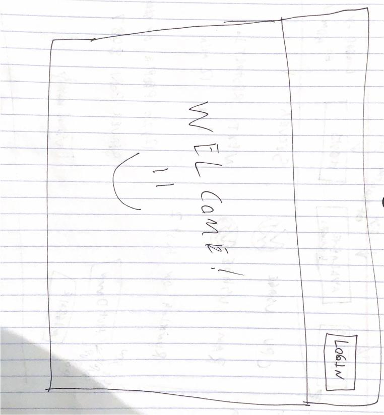
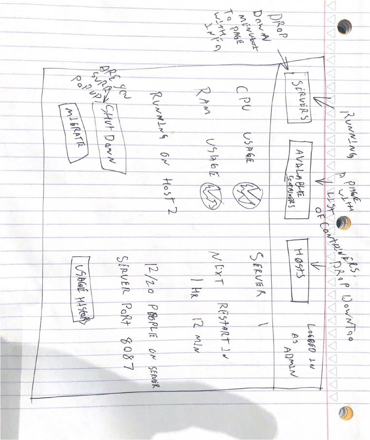

# startup
Have you ever wanted to run a server for each of the games you played? Or maybe you want to be able to swap what server is currently running without a hassle. You can with the Server handler! The Server Handler makes running servers easy by telling you exactly what you want to know. It includes images of your previous servers already set up as well as what servers are already running!

Key features:

- Secure login over HTTPS
- Ability to select and run containers on hosts
- Display of usage history per host/container
- Server information displayed in realtime
- Ability for a user import a new server container
- Current images are persistently stored
- Ability for admin to quickly start and stop servers

I learned from the simon assignment:
- never draw with html
- I give in when it comes to copy and paste strings of numbers :) but I did make sure I knew what it was doing and played around with it :) 
- I need to create more bash scripts for my personal projects
- There is a lot of variety in html
I learned from the second simon assignment
- bootstrap is almost like css in the html, meaning it makes the css shorter and easyer to use
- Drawing is a lot easier in css
- You can have position absolute but have it dynamic
- Most pages dont need a ton of css with bootstrap, only unique ones
